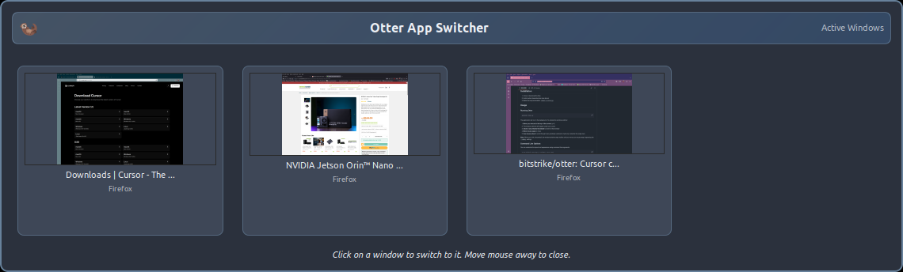

# Otter Window Switcher

A handy mouse-activated window switcher for GTK-based Linux desktop environments. Built with Claude, Python, GTK3, and Wnck.



## Features

Otter is a mouse-activated window switcher that appears when you move your cursor to any screen edge. It displays high-quality thumbnails of all open windows with intelligent multi-monitor positioning and GTK theme integration for a native appearance. Windows can be selected with a click, or managed through a context menu (right-click) offering operations like move, resize, minimize, maximize, and workspace management. Middle-clicking switches to a window's workspace without activation. The switcher supports MRU (Most Recently Used) ordering to keep frequently accessed windows at the front, respects fullscreen applications to avoid interrupting games or videos, and includes features like drag mode, mouse wheel scrolling, and auto-hide. It intelligently filters system windows, shows minimized windows with visual distinction, and handles multiple workspaces seamlessly across all connected monitors.


## Requirements

### Display Server
**X11 Only** - Otter requires X11 and does not support Wayland. Wnck (Window Navigator Construction Kit) relies on X11 window management protocols.

**Check your display server:**
```bash
echo $XDG_SESSION_TYPE
# Should output: x11
# If it outputs: wayland - Otter will not work
```

### Python Version
- Python 3.6 or higher

### System Dependencies

**Ubuntu/Debian:**
- `python3-gi`
- `python3-gi-cairo`
- `gir1.2-gtk-3.0`
- `gir1.2-wnck-3.0`

**Note:** All Python modules are from the standard library or system GObject Introspection bindings. No pip packages required! Using pip for GTK/Wnck is not recommended and may cause issues - use your system package manager instead.

## Installation

1. Clone or download the files
2. Install system dependencies using your package manager (see Requirements above)
3. Make the script executable: `chmod +x otter.py`

## Usage

### Basic Usage
```bash
./otter.py
```

The application runs in the background. To activate:

1. **Move your mouse to the top edge** of the screen (default: north)
2. The window switcher appears under your cursor
3. **Click on any thumbnail** to switch to that window
4. **Middle-click on any thumbnail** to switch to that app's workspace without activating it
5. **Right-click** for context menu with window operations
6. **Mouse wheel** to scroll through windows
7. **Move mouse away** to auto-hide

### Command Line Options

```bash
# Basic examples
./otter.py                              # Default: north edge, 4 columns
./otter.py --south                      # Trigger on bottom edge
./otter.py --east                       # Trigger on right edge
./otter.py --west                       # Trigger on left edge

# Layout customization
./otter.py --ncols 6                    # 6 columns, auto rows
./otter.py --nrows 2                    # 2 rows, auto columns
./otter.py --xsize 200                  # Larger thumbnails (200px width)
./otter.py --notitle                    # Disable title bar

# Advanced features
./otter.py --recent                     # MRU ordering (most recent first)
./otter.py --main-character             # Don't trigger during fullscreen apps
./otter.py --delay 500                  # 500ms delay before hiding

# Combined example (gaming setup)
./otter.py --east --ncols 6 --notitle --recent --main-character

# Show help
./otter.py --help
```

#### Available Options

**Layout Options** (mutually exclusive):
- `--nrows NUM`: Number of rows (auto-calculates columns)
- `--ncols NUM`: Number of columns (auto-calculates rows, default: 4)

**Appearance Options**:
- `--xsize PIXELS`: Thumbnail width in pixels (height auto-calculated, default: 160)
- `--notitle`: Disable the fancy title bar to save screen space

**Behavior Options**:
- `--delay MILLISECONDS`: Delay before hiding the window (default: 0)
- `--recent`: Order thumbnails by most recently used (MRU)
- `--main-character`: Disable edge trigger when fullscreen app is active (gaming mode)

**Edge Trigger Options** (mutually exclusive):
- `--north`: Trigger at top edge (default)
- `--south`: Trigger at bottom edge
- `--east`: Trigger at right edge (recommended for gaming)
- `--west`: Trigger at left edge

**Notes:**
- `--nrows` and `--ncols` are mutually exclusive - specify only one
- Edge trigger options are mutually exclusive - specify only one
- `--delay` may cause minor visual flickering on hide
- `--main-character` prevents interrupting games like Minecraft when in fullscreen

## Window Operations

### Drag App Feature
Right-click any window thumbnail and select **"Drag App"** to enter drag mode:

1. Cursor automatically warps to the window's title bar center
2. Interactive window move mode is activated
3. Move your mouse to reposition the window
4. Click or press Enter to place the window at the new location

**Implementation:**
The feature uses a simple, reliable three-step approach:
1. **Cursor warp** - Uses Gdk to move cursor to window title bar center
2. **Window activation** - Activates the window so it receives input
3. **Move mode initiation** - Calls Wnck's keyboard_move() to enter interactive move mode

**How it works:**
- Warps cursor using Gdk (proven to work reliably)
- Activates window to ensure it receives mouse input
- Initiates interactive move mode through window manager (Wnck keyboard_move)
- Window follows mouse movement until clicked or Enter pressed
- Pure Python implementation using GTK and Wnck (no external tools)

## Customization

### Command Line
The easiest way to customize is through command line arguments:

- **Edge trigger**: Use `--north`, `--south`, `--east`, or `--west`
- **Layout**: Use `--nrows` OR `--ncols` to control grid layout
- **Thumbnail size**: Use `--xsize` to set thumbnail width
- **Title bar**: Use `--notitle` to disable for minimal appearance
- **Hide delay**: Use `--delay` to set auto-hide delay
- **MRU ordering**: Use `--recent` for smart window ordering
- **Gaming mode**: Use `--main-character` to respect fullscreen apps

### Code

For advanced customization, modify `otter.py`:

- **Trigger sensitivity**: Adjust `<= 5` in edge detection code (line ~256)
- **Window styling**: Modify CSS in `create_window()` (line ~524)
- **Cache update frequency**: Modify `cache_update_interval` (default: 2000ms, line ~174)
- **System app filtering**: Update `system_apps` list (line ~803)
- **Wnck recreation interval**: Modify `wnck_recreation_interval` (default: 120s for testing, line ~153)


## Testing

Otter includes a comprehensive unit test suite to ensure code changes maintain functionality.

```bash
# Run all tests
cd tests
./run_tests.py

# Run specific test module
./run_tests.py test_configuration
./run_tests.py test_edge_detection
./run_tests.py test_wnck_management
```

**Test Coverage:**
- Configuration and command-line parsing (59 tests total)
- Edge detection and mouse positioning
- Multi-monitor support
- MRU ordering logic
- Wnck state management and error recovery
- HIDE_STATE semaphore behavior
- Fullscreen detection
- System window filtering

See [tests/README.md](tests/README.md) for detailed testing documentation.


## License

This project is licensed under the GNU General Public License v3.0 (GPL-3.0).

```
Otter Window Switcher - Mouse-activated window switcher for Linux
Copyright (C) 2025

This program is free software: you can redistribute it and/or modify
it under the terms of the GNU General Public License as published by
the Free Software Foundation, either version 3 of the License, or
(at your option) any later version.

This program is distributed in the hope that it will be useful,
but WITHOUT ANY WARRANTY; without even the implied warranty of
MERCHANTABILITY or FITNESS FOR A PARTICULAR PURPOSE. See the
GNU General Public License for more details.

You should have received a copy of the GNU General Public License
along with this program. If not, see <https://www.gnu.org/licenses/>.
```

---

**Tip**: For gaming setups, try: `./otter.py --east --main-character --recent --notitle`

This positions the trigger on the right edge (away from game UI), respects fullscreen mode, orders windows by recent use, and saves screen space.
